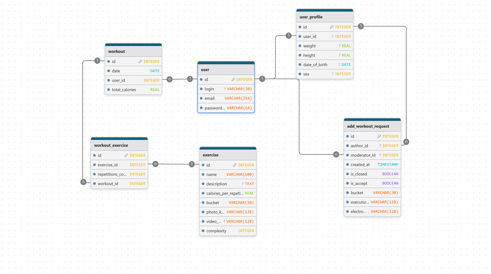

# 🏋️‍♂️ WorkoutTracker

[](https://dotnet.microsoft.com/)
[](https://asp.net/)
[](https://docs.microsoft.com/ef/)
[](https://www.postgresql.org/)

**WorkoutTracker** — это веб-приложение для спортсменов и любителей фитнеса, которое помогает отслеживать прогресс, анализировать технику выполнения упражнений и создавать собственные тренировочные программы.

---

## 📋 Назначение

Проект создан для тех, кто хочет:

- **Отслеживать свои тренировки** и видеть **графический прогресс** (вес, количество калорий, продолжительность тренировок).
- **Сравнивать технику выполнения упражнений**.
- **Создавать авторские упражнения и тренировки**, которых нет в стандартных базах.

Это идеальный инструмент для персонализированного фитнес-дневника с возможностью глубокого анализа.

---

## 🚀 Возможности (MVP)

- ✅ Регистрация / авторизация пользователя
- ✅ Создание и редактирование **собственных упражнений** (название, группа мышц, описание техники, доказательство эффективности, видео выполнения)
- ✅ Создание **авторских тренировок** (сборка из упражнений, подходы, вес, повторения)
- ✅ Визуализация прогресса: графики изменения веса занимающегося, график тренировок, их продолжительность
- ✅ Сравнение техники: добавление видео и непосредственное сравнение с видео правильного исполнения
- ✅ Хранение всех данных в **PostgreSQL**
- ✅ Ролевое разделение на пользователей и модераторо 

---

## 🛠 Технологический стек

| Компонент          | Технология                                      |
|--------------------|-------------------------------------------------|
| **Backend**        | .NET 8, ASP.NET Core                            |
| **ORM**            | Entity Framework Core (Code First)              |
| **База данных**    | PostgreSQL                                      |
| **Аутентификация** | ASP.NET Core Identity (JWT + Cookies)           |
| **Фронтенд**       | |

---

## ER-диаграмма



---

## 🧪 Как запустить проект локально

### 1. Клонируй репозиторий
```bash
git clone https://gitverse.ru/itis_kislov/asp-sem-work-vinwap07
cd asp-sem-work-vinwap07
```

ДОПИСАТЬ